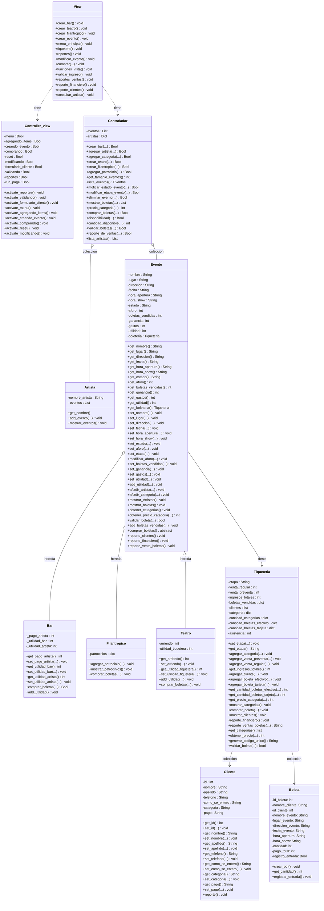

```mermaid  
classDiagram
class View {
        +crear_bar() void
        +crear_teatro() void
        +crear_filantropico() void
        +crear_evento() void
        +menu_principal() void
        +tiquetera() void
        +reportes() void
        +modificar_evento() void
        +comprar(...) void
        +funciones_vista() void
        +validar_ingreso() void
        +reportes_ventas() void
        +reporte_financiero() void
        +reporte_clientes() void
        +consultar_artista() void
    }
    class Controller_view {
        -menu : Bool
        -agregando_items : Bool
        -creando_evento : Bool
        -comprando : Bool
        -reset : Bool
        -modificando : Bool
        -formulario_cliente : Bool
        -validando : Bool
        -reportes : Bool
        -run_page : Bool
        +activate_reportes() void
        +activate_validando() void
        +activate_formulario_cliente() void
        +activate_menu() void
        +activate_agregando_items() void
        +activate_creando_evento() void
        +activate_comprando() void
        +activate_reset() void
        +activate_modificando() void
    }
    class Controlador {
        -eventos : List
        -artistas : Dict
        +crear_bar(...) Bool
        +agregar_artista(...) Bool
        +agregar_categoria(...) Bool
        +crear_teatro(...) Bool
        +crear_filantropico(...) Bool
        +agregar_patrocinio(...) Bool
        +get_tamanio_eventos() int
        +lista_eventos() Eventos
        +moficar_estado_evento(...) Bool
        +modificar_etapa_evento(...) Bool
        +eliminar_evento(...) Bool
        +mostrar_boletas(...) List
        +precio_categoria(...) int
        +comprar_boletas(...) Bool
        +disponibilidad(...) Bool
        +cantidad_disponible(...) int
        +validar_boletas(...) Bool
        +reporte_de_ventas(...) Bool
        +lista_artistas() List
    }
    class Artista {
        -nombre_artista : String
        - eventos : List
        +get_nombre()
        +add_evento(...) void
        +mostrar_eventos() void
    }
    class Bar {
        -_pago_artista : int
        -_utilidad_bar : int
        -_utilidad_artista: int
        +get_pago_artista() int
        +set_pago_artista(...) void
        +get_utilidad_bar() int
        +set_utilidad_bar(...) void
        +get_utilidad_artista() int
        +set_utilidad_artista(...) void
        +comprar_boletas(...) Bool
        +add_utilidad() void
    }
    class Cliente {
        -id : int
        -nombre : String
        -apellido : String
        -telefono : String
        -como_se_entero : String
        -categoria : String
        -pago : String
        +get_id() int
        +set_id(...) void
        +get_nombre() String
        +set_nombre(...) void
        +get_apellido() String
        +set_apellido(...) void
        +get_telefono() String
        +set_telefono(...) void
        +get_como_se_entero() String
        +set_como_se_entero(...) void
        +get_categoria() String
        +set_categoria(...) void
        +get_pago() String
        +set_pago(...) void
        +reporte() void
    }
    class Evento {
        -nombre : String
        -lugar : String
        -direccion : String
        -fecha : String
        -hora_apertura : String
        -hora_show : String
        -estado : String
        -aforo : int
        -boletas_vendidas : int
        -ganancia : int
        -gastos : int
        -utilidad : int
        -boleteria : Tiqueteria
        +get_nombre() String
        +get_lugar() String
        +get_direccion() String
        +get_fecha() String
        +get_hora_apertura() String
        +get_hora_show() String
        +get_estado() String
        +get_aforo() int
        +get_boletas_vendidas() int
        +get_ganancia() int
        +get_gastos() int
        +get_utilidad() int
        +get_boleteria() Tiqueteria
        +set_nombre(...) void
        +set_lugar(...) void
        +set_direccion(...) void
        +set_fecha(...) void
        +set_hora_apertura(...) void
        +set_hora_show(...) void
        +set_estado(...) void
        +set_aforo(...) void
        +set_etapa(...) void
        +modificar_aforo(...) void
        +set_boletas_vendidas(...) void
        +set_ganancia(...) void
        +set_gastos(...) void
        +set_utilidad(...) void
        +add_utilidad(...) void
        +añadir_artista(...) void
        +añadir_categoria(...) void
        +mostrar_Artistas() void
        +mostrar_boletas() void
        +obtener_categorias() void
        +obtener_precio_categoria(...) int
        +validar_boleta(...) bool
        +add_boletas_vendidas(...) void
        +comprar_boletas() abstract
        +reporte_clientes() void
        +reporte_financiero() void
        +reporte_venta_boletas() void
    }
    class Filantropico {
        -patrocinios : dict
        +agregar_patrocinio(...) void
        +mostrar_patrocinios() void
        +comprar_boletas(...) void
    }
    class Teatro {
        -arriendo : int
        -utilidad_tiquetera : int
        +get_arriendo() int
        +set_arriendo(...) void
        +get_utilidad_tiquetera() int
        +set_utilidad_tiquetera(...) void
        +add_utilidad(...) void
        +comprar_boletas(...) void
    }
    class Tiqueteria {
        -etapa : String
        -venta_regular : int
        -venta_preventa : int
        -ingresos_totales : int
        -boletas_vendidas : dict
        -clientes : list
        -categoria : dict
        -cantidad_categorias : dict
        -cantidad_boletas_efectivo : dict
        -cantidad_boletas_tarjeta : dict
        -asistencia : int
        +set_etapa(...) void
        +get_etapa() String
        +agregar_categoria(...) void
        +agregar_venta_preventa(...) void
        +agregar_venta_regular(...) void
        +get_ingresos_totales() int
        +agregar_cliente(...) void
        +agregar_boleta_efectivo(...) void
        +agregar_boleta_tarjeta(...) void
        +get_cantidad_boletas_efectivo(...) int
        +get_cantidad_boletas_tarjeta(...) int
        +get_precio_categoria(...) int
        +mostrar_categorias() void
        +comprar_boleta(...) void
        +mostrar_clientes() void
        +reporte_financiero() void
        +reporte_ventas_boletas(...) String
        +get_categorias() list
        +obtener_precio(...) int
        +generar_codigo_unico() String
        +validar_boleta(...) bool
    }
    class Boleta {
        -id_boleta: int
        -nombre_cliente: String
        -id_cliente: int
        -nombre_evento: String
        -lugar_evento: String
        -direccion_evento: String
        -fecha_evento: String
        -hora_apertura: String
        -hora_show: String
        -cantidad: int
        -pago_total: int
        -registro_entrada: Bool
        +crear_pdf() void
        +get_cantidad() int
        +registrar_entrada() void
    }

View ..> Controller_view : tiene
View ..> Controlador : tiene

Controlador o-- Artista : coleccion
Controlador o-- Evento : coleccion

Evento <|-- Bar : hereda
Evento <|-- Filantropico : hereda
Evento <|-- Teatro : hereda
Evento --> Tiqueteria : tiene

Tiqueteria --> Cliente : coleccion
Tiqueteria --> Boleta : coleccion
```